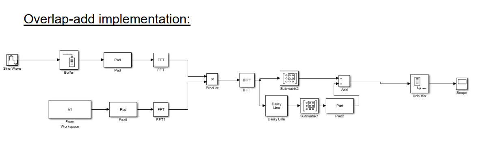
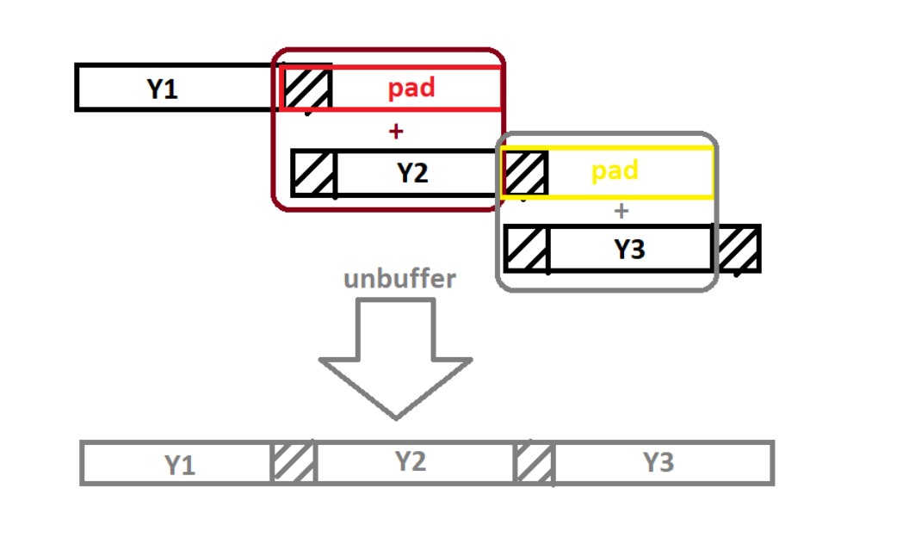
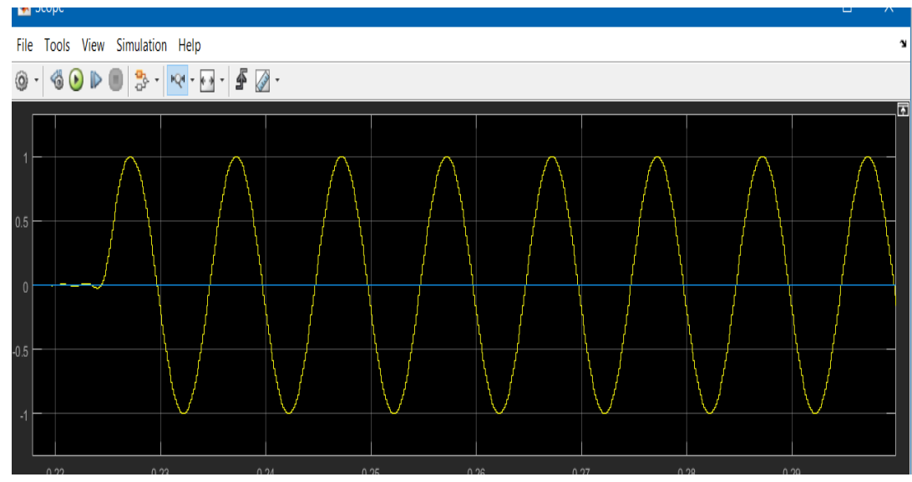
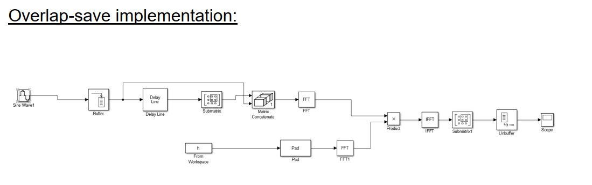
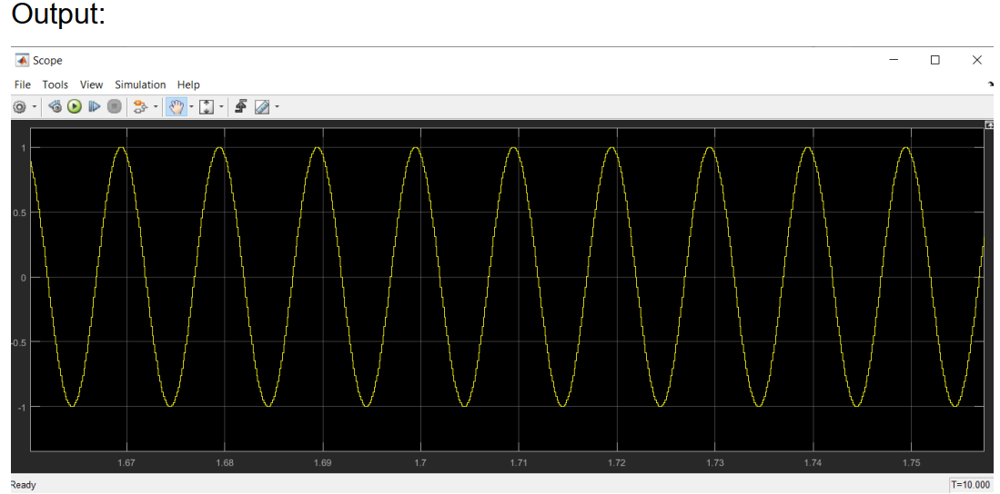
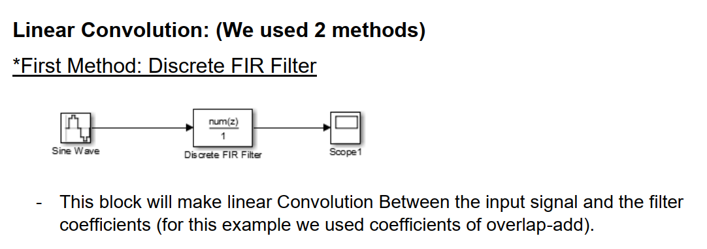
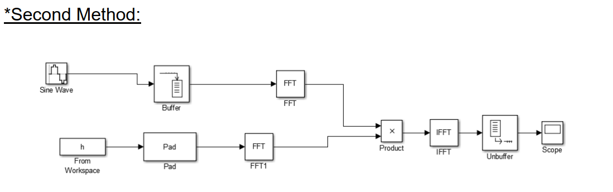
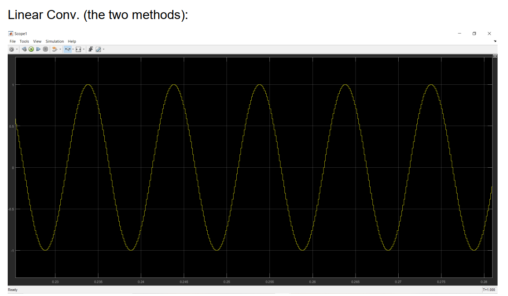

 # TASK 1(Block Filtering)
                                       Using Overlap-Add and Overlap-Save Algorithms  
                                       
# The Overlap-Add method
is based on the observation that when we consider two discrete-time
signals, say xk(n) and h(n), with support L and support M, respectively (note: the support is the length of
the smallest consecutive stretch of points that contains all non-zero signal elements), the resulting
convolution yk(n) = xk(n) * h(n), has a support of L+M-1. For example, say the support for xk(n) is n = 0,
…, L-1 and the support for h(n) is n = 0, …, M-1, then the support for yk(n) is at n = 0, …, L+M-2. The
questions at the end of this lab will elucidate this concept.
Using this idea suppose our input stream x(n) is an infinite sequence starting at time n = 0. Divide
x(n) into L-length blocks and convolve each L-block with h(n) (using linear convolution). Then sum all
the convolution outcomes along the L-boundaries (we elaborate more soon). This works because of the
additive property of convolution which states (x1(n) + x2(n)) * h(n) = x1(n) * h(n) + x2(n) * h(n)

# The Overlap-Save method 
is a bit more difficult to explain than the Overlap-Add method as it is
based, in part, on the concept of circular convolution which in this context results in time-domain
aliasing. We describe an Overlap-Save method with the same throughput of L samples per block
processed as discussed for Overlap-Add.
Textbooks often give complicated formulas when explaining circular convolution. Here is an
easier way to consider circular convolution. Let’s consider xk(n) and h(n) with support regions n = 0, …,
N-1 and n = 0, …, M-1, respectively; note the difference from the previous section: the support length for
xk(n) is now N for Overlap-Save, but it was L for Overlap-Add. Let yL,k(n) be the result of normal
convolution (often called linear convolution) of xk(n) and h(n). Then the N-circular convolution of xk(n)
and h(n) can be described in terms of yL,k(n) via the diagram in Figure 4 for N = 4 and M = 3. Consider
two stages. The first stage takes a periodic extension of the linear convolution result yL,k(n) where the
period used for the extension is N. The second stage windows the result such that we consider only N
points at n = 0, …, N-1 leaving all other points with zero-values. The periodic extension is created by
adding all shifted versions (where the shifts are restricted to be integer multiples of N) of the linear
convolution result yL,k(n). Because xk(n) is of length N and h(n) of length M, the length of yL,k(n) will be
N+M-1. Thus, taking a periodic extension of yL,k(n) with period N will result in overlap. Since the overall
goals is to conduct a linear convolution (but using the FFT), this overlap is essentially “corruption” in the
beginning of the windowed sequence as shown in Figure 4. In general the points at n = 0, 1, 2, …, M-2
will be corrupt from what we call time-domain “self-aliasing”. However, the remaining points at n = M-1,
M-2, M-3, …, N-1 will still be equal to the desired yL,k(n).

# LinearConvolution 
Linear convolution gives the output we get after passing the input through a system ( eg. filter). So, if the impulse response of a system is known, then the response for any input can be determined using convolution operation.
Circular convolution utilises the periodicity of samples in DFT and hence gives the result efficiently. But as we require the output we get by linear convolution, we padd the input or impulse response whatever is short with zeros called zero padding.
The efficiency of circular convolution is utilised in many algorithms to find DFT digitally , the most common algorithm is FFT( fast fourier transform).

